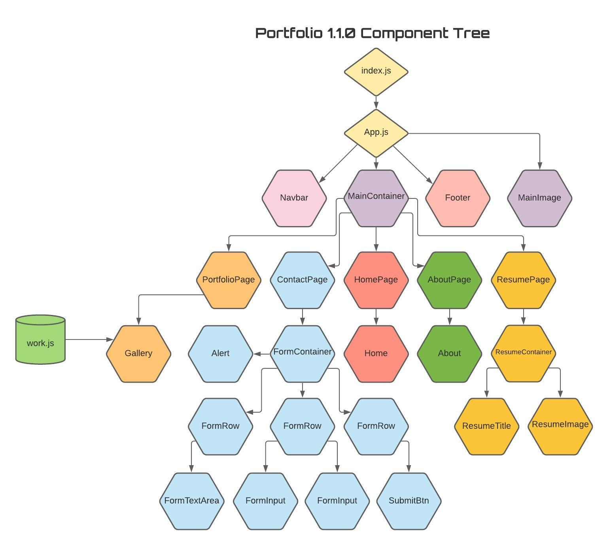

# Nate M King - React Portfolio Redesign


[Portfolio Deploy Link](http://www.natemking.dev/)

[](https://github.com/natemking/portfolio_2.0/blob/main/LICENSE)


---
## Table of Contents
 * [Description](#description)
  * [Dependencies](#dependencies)
  * [Screenshots](#screenshots)
  * [License](#license)
  * [Credits](#credits)

## Description
This portfolio is a full front-end only React site. Routing is done with react-router via hash routing. There are 5 pages for the user: home, about, portfolio, resume, & contact. 

The about and home pages are simple static text renders to provide the user basic info. The portfolio is made up of a container called `Gallery` that pulls in data from a `.js` file that stores all of the information for my projects to be displayed. This data is then sent to two children to render data to the user. The first child is called the `GalleryDeck`. This component displays an image of all the available pieces of work. These images are interactive and when a user clicks on one this triggers a state change in `Gallery` which in turn sends that projects corresponding data to the `GalleryJumbo`. This component takes that info and renders a gif of the project with information on that project. If the user clicks on another project the state is updated and the newly selected project data appears in the `GalleryJumbo`. 

The resume page goes to a component called `ResumeContainer`. Here the resume is rendered in a `ResumeImage` component. The `ResumeTitle` component is also rendered. Here there is a clickable icon. When clicked the page state is changed and page 2 of the resume is displayed as well as a state change to display the corresponding page number. Lastly, a link is provided to download the resume. 

The last page is the contact page with loads a contact form. This form consists of three-row components. Two inputs are in one row followed by a text area in another and finally a submit button in the third. There are multiple uses of state in the form that mostly all depend on user input. As the user adds data the state is updated via `onChange` methods. Before the user can submit an email they must pass a Turing test with a reCAPTCHA to prevent bots from flooding my email. When the test is passed the submit button becomes active and the user can submit an email. Emails are relayed via EmailJS. Depending on whether the email failed or succeeded, the user gets an alert according to the status of the email. 

Some other features utilized in this project are Reacts built-in code splitting. This allowed for a package called react-loading to display a loading bar during latency in the routing stage. There is also a lazy loading package for blurring photos that are rendering. Lastly, I utilized a fade-in effect that was shared and published by Josh Comeau (link in credits section below) that I was able to apply to the pages as they loaded for a smoother transition. This effect did present an issue with the mobile response as it was affecting the z-index of certain elements. I was able to write a pure function that simply sees what size the screen is and renders the page with a fade if it's large and without if it's mobile. Lastly, I added a service worker to make my portfolio a PWA site. 
 

## Dependencies
The following are used outside of the standard React dependencies:
```
bootstrap -> styling
email-js -> email relay
gh-pages -> deployment
react-google-recaptcha -> turning test
react-lazy-load-image-component -> img lazy load w/ effects
react-router-dom -> routing
styled-components -> used in FadeIn effect

added in v1.1.0
photoswipe
react-photoswipe-gallery

```
## Screenshots


<br>
_Large Screen Experience_
<br>
<br>

<br> 
_Mobile Experience_
<br>
<br>

<br>

## License
Licensed under the GNU GPLv3.0 License. Copyright © 2020

## Credits

* [Getting Footer to appear fixed](https://stackoverflow.com/questions/25870365/troubles-with-keeping-footer-below-content)

* [React loading](https://medium.com/swlh/add-loading-animation-to-your-react-app-db3999a5c88d)

* [Fade in effect](https://www.joshwcomeau.com/snippets/react-components/fade-in/)

* [Pathing local images in a seed json correctly](https://forum.freecodecamp.org/t/display-image-from-local-json-js-object-using-react/408351/14) 

* [Background photo by Ben Wentzel](https://www.benwentzel.net/)

* [Add loading screen to image load](https://medium.com/better-programming/a-quick-and-easy-react-js-loading-screen-with-hooks-940feccd553f)

---

GitHub: [@natemking](https://github.com/natemking/)

Email: [natmeking@gmail.com](mailto:natmeking@gmail.com)

